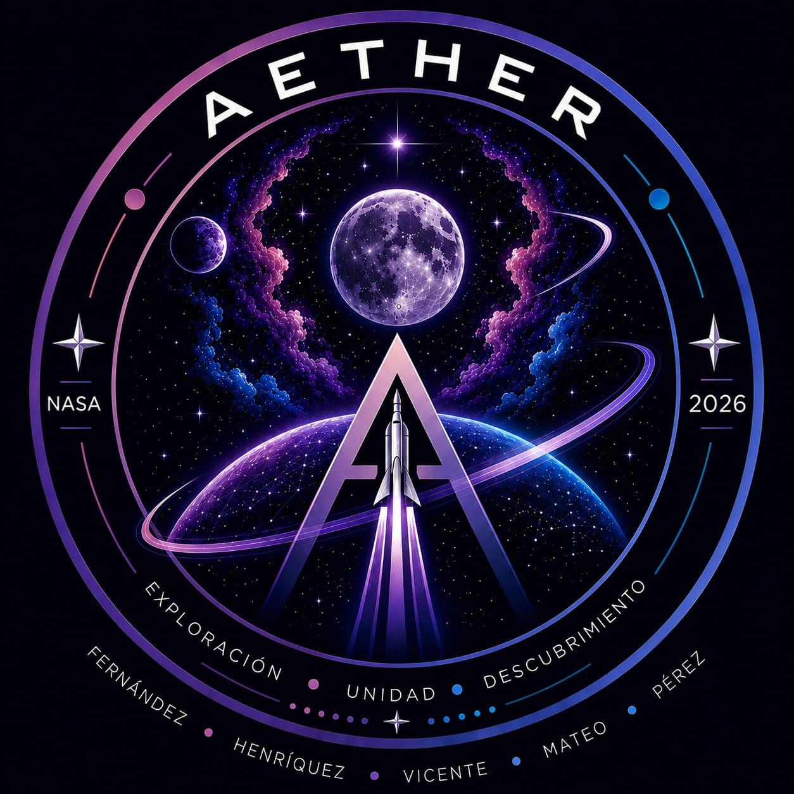

# Proyecto Aether
Simulador de misión lunar Aether desarrollado para INF272 utilizando Java, Orekit y JavaFX.

  

<h1 align = "center">
  Aether (eter)
</h1>
 
  

  El antiguo concepto que se utilizaba para describir al
  espacio exterior, tambien es considerado el aire puro que respiran los dioses.

<h2 align = "center">
  Descripcion del proyecto
</h2>

  Simulador de la misión Artemis II desarrollado en Java utilizando Orekit y JavaFX. El proyecto recrea el viaje de la nave desde la Tierra hasta la Luna y su regreso, mostrando la trayectoria y datos de la misión en tiempo real. Además, aplica el ciclo completo de desarrollo de software, incluyendo análisis, diseño, pruebas y trabajo colaborativo.

<h2 align = "center">
Registro de riesgos
</h2>
 
  

<table>
  <tr>
<td> Riesgo </td>
<td> Probabilidad </td>
<td> Impacto </td>
<td> Plan de mitigacion </td>
  </tr>

<tr>
<td> Mala comunicacion entre los miembros del equipo </td>
<td> Media </td>
<td> Alta </td>
<td> Hablar con claridad en todo momento y repartir bien las tareas entre cada uno de los integrantes </td>
</tr>

<tr>
<td> Complicaciones con el codigo y la simulacion </td>
<td> Alta </td>
<td> Alta </td>
<td> Buscar ayuda en las partes que no entendamos ya sea al profesor o a la IA </td>
</tr>

<tr>
<td> Retrasos en las entregas de los trabajos </td>
<td> Media </td>
<td> Alta </td>
<td> Tener una fecha limite para entregar los trabajos antes de la fecha propuesta por el profesor, y revisar que todo este bien antes de realizar dicha entrega </td>
</tr>

<tr>
<td> Fallos durante las pruebas </td>
<td> Media </td>
<td> Alta </td>
<td> Revisar los codigos entre todos y dar retroalimentaciones  </td>
</tr>

<tr>
<td> Dificultad para coordinar las reuniones </td>
<td> Media </td>
<td> Alta </td>
<td> RPautar dos dias a la semana en los que todos los integrantes del grupo estemos desocupados para reunirnos y ponernos de acuerdo </td>
</tr>
